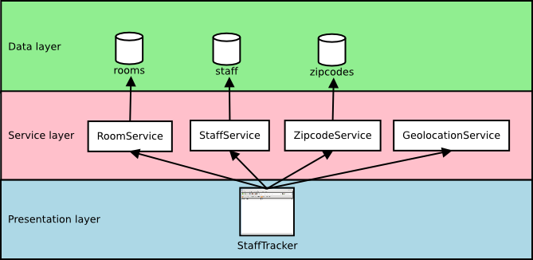

disnix-stafftracker-java-example
================================
This is an example case representing a system to manage staff of a university
department. The system uses data stored in several databases. For each database,
a web service interface is provided to retrieve and update records. Moreover, a
geo location service is provided using [GeoIP](http://www.maxmind.com/app/ip-location)
to determine the location of a staff member using an IP address. A web
application front-end is provided for end-users to retrieve and edit staff
members.

Architecture
============


The above figure shows the architecture of this example, consisting of three
layers. The data layer contains various MySQL databases storing data sets. The
service layer provides web service interfaces to the databases (the
`GeolocationService` uses GeoIP to lookup location from an IP address). The
presentation layer contains a web application front-end which can be used by end
users to manage staff of a university. All the components in the figure are
*distributable* components (or *services*) which can deployed to various machines
in the network.

Usage
=====
The `deployment/DistributedDeployment` sub folder contains all neccessary Disnix
models, such as a services, infrastructure and distribution models required for
deployment.

Deployment using Disnix in a heterogeneous network
--------------------------------------------------
For this scenario only installation of the basic Disnix toolset is required.
First, you must manually install a network of machines running the Disnix service.
Then you must adapt the infrastructure model to match to properties of your
network and the distribution model to map the services to the right machines.

To deploy the databases you must install [MySQL](http://www.mysql.com). To deploy
the web services and web application services you must install
[Apache Tomcat](http://tomcat.apache.org). Check the instructions of your Linux
distribution or the software distributions themselves how to install these system
services. Dysnomia detects the presence of these system services and configures
the corresponding modules to use them.

The system can be deployed by running the following command:

    $ disnix-env -s services.nix -i infrastructure.nix -d distribution.nix

Hybrid deployment of NixOS infrastructure and services using DisnixOS
---------------------------------------------------------------------
For this scenario you need to install a network of NixOS machines, running the
Disnix service. This can be done by enabling the following configuration
option in each `/etc/nixos/configuration.nix` file:

    services.disnix.enable = true;

You may also need to adapt the NixOS configurations to which the `network.nix`
model is referring, so that they will match the actual system configurations.

The system including its underlying infrastructure can be deployed by using the
`disnixos-env` command. The following instruction deploys the system including
the underlying infrastructure.

    $ disnixos-env -s services.nix -n network.nix -d distribution.nix

Deployment using the NixOS test driver
--------------------------------------
This system can be deployed without adapting any of the models in
`deployment/DistributedDeployment`. By running the following instruction, the
variant without the proxy can be deployed in a network of virtual machines:

    $ disnixos-vm-env -s services.nix -n network.nix -d distribution.nix

Deployment using NixOps for infrastructure and Disnix for service deployment
----------------------------------------------------------------------------
It's also possible to use NixOps for deploying the infrastructure (machines) and
let Disnix do the deployment of the services to these machines.

A virtualbox network can be deployed as follows:

    $ nixops create ./network.nix ./network-virtualbox.nix -d vboxtest
    $ nixops deploy -d vboxtest

The services can be deployed by running the following commands:

    $ export NIXOPS_DEPLOYMENT=vboxtest
    $ disnixos-env -s services.nix -n network.nix -d distribution.nix --use-nixops

Deploying services as part of a NixOS configuration
---------------------------------------------------
Another example case is to deploy the staff tracker as part of a NixOS
configuration, instead of using Disnix to deploy the services.

A virtualbox network can be deployed as follows:

    $ nixops create ./network-monolithic.nix ./network-monolithic-virtualbox.nix -d vboxtest
    $ nixops deploy -d vboxtest

After the network has been deployed, we can activate the services by running:
    
    $ nixops ssh -d vboxtest test1 "dysnomia-containers --deploy"

Running the system
==================
After the system has been deployed, open a web browser and type the following URL:

    http://test2:8080/StaffTracker

The `test2` hostname must be replaced by the real hostname of the machine to
which the web application front-end is deployed. Check the distribution model for
this. If the network expression is used included in this example, the third
machine in the network machine automatically boots into IceWM and includes the
Mozilla Firefox web browser for convenience.

Advanced use cases
==================
Besides running a conventional deployment workflow that consists of deploying
machines and the container services (MySQL and Apache Tomcat) by external means
first and then the services with Disnix, it is also possible to let Disnix deploy
the containers.

Deploying containers and services
---------------------------------
The following commands can be used to let NixOps deploy bare machine
configurations with Disnix preinstalled and no additional container services:

    $ nixops create ./network-bare.nix ./network-virtualbox.nix -d vboxtest
    $ nixops deploy -d vboxtest

The following environment variables must be set to integrate Disnix with NixOps:

    $ export NIXOPS_DEPLOYMENT=vboxtest
    $ export DISNIX_CLIENT_INTERFACE=disnix-nixops-client

With the following command we can dynamically generate a Disnix infrastructure
model from the machine's configuration:

    $ disnix-capture-infra $(disnixos-geninfra network-bare.nix network-virtualbox.nix --use-nixops) > infrastructure-bare.nix

The captured infrastructure model may look as follows:

```nix
{
  "test1" = {
    properties = {
      "hostname" = "test1";
    };
    containers = {
      process = {
      };
      wrapper = {
      };
    };
  };
  "test2" = {
    properties = {
      "hostname" = "test2";
    };
    containers = {
      process = {
      };
      wrapper = {
      };
    };
  };
}
```

As may be observed in the expression above, we have a very minimalistic
infrastructure model only exposing the wrapper and process containers that
integrate with the host system's service manager (in NixOS' case: systemd).

The following command deploys the MySQL DBMS server and Apache Tomcat server as
Disnix services:

    $ disnix-env -s services-containers.nix -i infrastructure-bare.nix -d distribution-containers.nix --profile containers

After the above command succeeds, we can capture the machine configurations
again:

    $ disnix-capture-infra infrastructure-bare.nix > infrastructure-containers.nix

The captured configuration may now look as follows:

```nix
{
  "test1" = {
    properties = {
      "hostname" = "test1";
    };
    containers = {
      tomcat-webapplication = {
        "tomcatPort" = "8080";
      };
      process = {
      };
      wrapper = {
      };
    };
  };
  "test2" = {
    properties = {
      "hostname" = "test2";
    };
    containers = {
      mysql-database = {
        "mysqlUsername" = "root";
        "mysqlPassword" = "secret";
        "mysqlPort" = "3306";
      };
      tomcat-webapplication = {
        "tomcatPort" = "8080";
      };
      process = {
      };
      wrapper = {
      };
    };
  };
}
```

As may be observed, both machines now provide a `tomcat-webapplication`
container. In addition, machine `test2` provides a `mysql-database` container
as a result of deploying the containers.

We can use the newly captured infrastructure model and the "conventional"
services model to deploy the databases and web applications that constitute the
StaffTracker system:

    $ disnix-env -s services.nix -i infrastructure-containers.nix -d distribution.nix --profile services

After the above command succeeds, we have the StaffTracker system running whose
services and underlying containers both have been deployed with Disnix.

Deploying multiple instances of containers and services
-------------------------------------------------------
When using Disnix for deploying the containers, it is also possible to run
multiple MySQL and Apache Tomcat servers on one machine and to deploy services
to them.

As with the previous example, we must first deploy a network without any
additional containers:

    $ nixops create ./network-bare.nix ./network-virtualbox.nix -d vboxtest
    $ nixops deploy -d vboxtest

We must set the following environment variables to integrate Disnix with
NixOps:

    $ export NIXOPS_DEPLOYMENT=vbox
    $ export DISNIX_CLIENT_INTERFACE=disnix-nixops-client

As with the previous example, the following command yields a basic
infrastructure model:

    $ disnix-capture-infra $(disnixos-geninfra network-bare.nix network-virtualbox.nix --use-nixops) > infrastructure-bare.nix

Running the following command deploys a multi-container scenario in which one
machines hosts two MySQL servers and the other two Apache Tomcat servers:

    $ disnix-env -s services-multicontainers.nix -i infrastructure-bare.nix -d distribution-multicontainers.nix --profile containers

After deployment of the containers succeeds, we can capture the infrastructure
model again:

    $ disnix-capture-infra infrastructure-bare.nix > infrastructure-containers.nix

As may be noticed, we have two MySQL containers and two Apache Tomcat containers
on one machine in the captured infrastructure model:

```nix
{
  "test1" = {
    properties = {
      "hostname" = "test1";
    };
    containers = {
      mysql-production = {
        "mysqlUsername" = "root";
        "mysqlPassword" = "secret";
        "mysqlPort" = "3306";
        "mysqlSocket" = "/run/mysqld-production/mysqld.sock";
      };
      mysql-test = {
        "mysqlUsername" = "root";
        "mysqlPassword" = "secret";
        "mysqlPort" = "3307";
        "mysqlSocket" = "/run/mysqld-test/mysqld.sock";
      };
      process = {
      };
      wrapper = {
      };
    };
  };
  "test2" = {
    properties = {
      "hostname" = "test2";
    };
    containers = {
      tomcat-production = {
        "tomcatPort" = "8080";
        "catalinaBaseDir" = "/var/tomcat-production";
      };
      tomcat-test = {
        "tomcatPort" = "8081";
        "catalinaBaseDir" = "/var/tomcat-test";
      };
      process = {
      };
      wrapper = {
      };
    };
  };
}
```

To allow two instances to run next of each other, they have been configured in
such a way that their resources do not conflict. For example, they bind to
different TCP ports, use different state directories and different UNIX domain
socket paths.

After deploying the container configuration, we can deploy the services to them,
by running:

    $ disnix-env -s services.nix -i infrastructure-containers.nix -d distribution-advanced.nix --profile services

License
=======
This package is released under the [MIT license](http://opensource.org/licenses/MIT).
